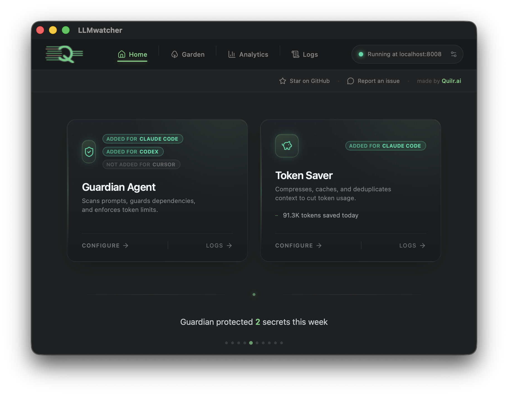

# AgentGuard

**[Download for Mac (Apple silicon) - 12MB](https://github.com/quilrai/AgentGuard/releases/latest/download/AgentGuard-Apple-Silicon.dmg)**

**Download Windows (Coming Soon)**

Local DLP + observability layer for AI coding agents.

**Fully local (on-device), desktop app for**
- Block requests containing sensitive information (credentials, secrets, PII) with regex + keyword patterns
- Protect against malicious or outdated dependencies before they're installed
- Save tokens via shell output compression and smart file-read caching
- Full searchable history of LLM requests, tool calls, and DLP detections
- Visualize your codebase as a living garden — file hotspots, module structure, import graphs
- Analyze agent behaviour trends: read discipline, exploration balance, bash reliance, tool tempo
- Supports Claude Code, Codex CLI, and Cursor IDE out of the box

## How it works

AgentGuard runs a local HTTP server on `localhost:8008`. When you install hooks for an agent, small scripts are registered that POST hook events to this server — no proxy, no traffic interception.

- **Claude Code**: hooks registered in `~/.claude/settings.json` (UserPromptSubmit, PreToolUse, PostToolUse, Stop, SessionStart, SessionEnd)
- **Codex CLI**: hook scripts installed to `~/.codex/hooks/` with `~/.codex/hooks.json`
- **Cursor IDE**: hooks registered in `~/.cursor/hooks/`

## Features

### DLP (Data Loss Prevention)
- Regex + keyword pattern matching against prompts, tool inputs, and file reads
- Pre-built patterns for API keys, credentials, secrets, PII, and more
- Add your own patterns — configurable per agent
- Detections can block the request or log with full context for review

### Dependency Protection
- **Vulnerability Guard**: checks packages against the [OSV database](https://osv.dev) before install — blocks if vulnerabilities are found
- **Update Advisor**: detects outdated exact-pinned packages and advises the agent of newer versions
- Covers install commands (`pip install`, `npm install`, `cargo add`, `go get`, and more) and dependency file writes (`requirements.txt`, `package.json`, `Cargo.toml`, etc.)
- Supports PyPI, npm, crates.io, Maven, Go, RubyGems, NuGet, Packagist

### Token Limit
- Set a per-agent max tokens per request — requests exceeding the limit are blocked

### Token Savings

**Shell Compression**
- Intercepts shell command output and compresses it before the agent sees it
- Reduces token usage on verbose build/test/log output
- Configurable per agent (Claude Code and Cursor)

**Context-Aware File Read Caching**
- Session-scoped file cache with stable references (F1, F2, …)
- Automatically picks the best read mode: full, diff, or line range
- Avoids re-sending unchanged file content across turns

### Garden (Codebase Visualizer)
- Each project is rendered as a living garden: modules are groves, sub-folders are clearings
- Tree height = file size; canopy tiers = number of times touched; canopy color = which agent touched it most
- Hero trees (hottest files) are shown in the foreground; lightly-touched files appear as background bushes
- Sun brightness = cache hit ratio; gold/copper coins = full-price vs cached input tokens
- Click any tree to see its imports and definitions (functions, classes, structs, etc.) extracted via tree-sitter
- Dashed curves connect trees that import from each other (import graph)

### Agent Behaviour Monitor
- Day-wise trend graphs for key metrics: read-first discipline, exploration balance, bash reliance, tool tempo
- Operating mix breakdown: explore / modify / bash / other
- Session drilldown: files touched, tool tags, bash previews, blocked-turn markers
- Covers active days, avg turns/session, files touched/session, guardrail activity

### Logging & Observability
- All hook events logged locally to SQLite: prompts, tool calls, DLP detections, token usage
- Full-text searchable request history per agent
